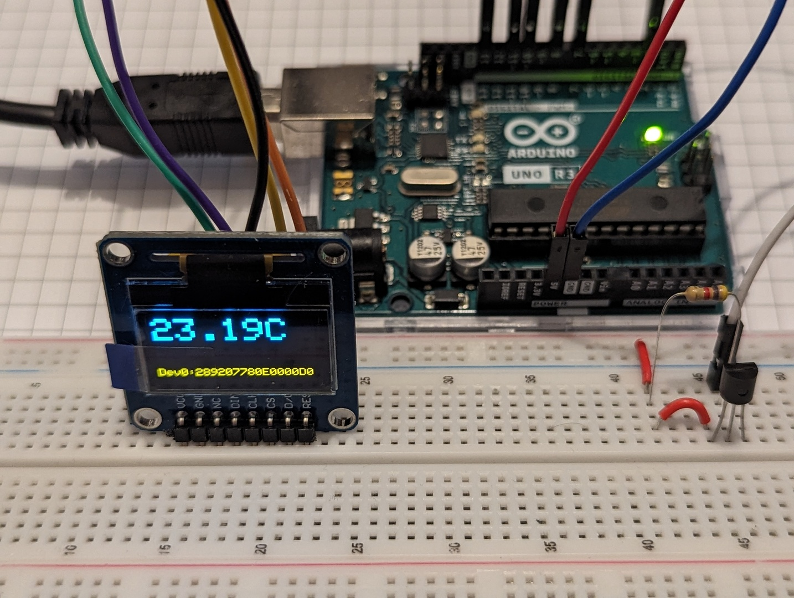

# About

A simple thermometer (DS18B20 on 1-Wire) and a display (SSD1306 on SPI) controlled by Arduino.

# Hardware

- DS18B20 Programmable Resolution 1-Wire Digital Thermometer
- SSD1306 Display - 0.96inch OLED (B) - connected to 4-wire SPI (default case)

# Setup

Install required libraries.

In Arduino IDE (2.3.1) | Sketch | Include Library | Manage Libraries...

For DS18B20 thermometer:
- [DallasTemperature 3.9.0](https://www.arduino.cc/reference/en/libraries/dallastemperature/) - [https://github.com/milesburton/Arduino-Temperature-Control-Library](https://github.com/milesburton/Arduino-Temperature-Control-Library)
- [OneWire 2.3.7](https://www.arduino.cc/reference/en/libraries/onewire/) - [https://github.com/PaulStoffregen/OneWire](https://github.com/PaulStoffregen/OneWire)

For SSD1306 display:
- [Adafruit SSD1306](https://www.arduino.cc/reference/en/libraries/adafruit-ssd1306/) - [https://github.com/adafruit/Adafruit_SSD1306](https://github.com/adafruit/Adafruit_SSD1306)

# Connections

## SPI for 4-wire OLED WaveShare 0.96inch (SSD1306)

Arduino UNO R3 has one Serial Peripheral Interface (SPI) controller with predefined pins. In this case CIPO (D12) is not used.

Arduino Pin | Name | Other common names | [Description](https://en.wikipedia.org/wiki/Serial_Peripheral_Interface)
----------- | ---- | ------------------ | ---
D10 | SS | **_CS_**, nCS, CSB, CSN, nSS, STE, SYNC | Chip Select
D11 | _COPI_ | **MOSI**, SIMO, SDO, DO, DOUT, SO, MTSR | Master out, slave in
D12 | CIPO | **MISO**, SOMI, SDI, DI, DIN, SI, MRST | Master in, slave out
D13 | _SCK_ | **SCLK**, CLK | Serial Clock

WaveShare 0.96inch (SSD1306) configured in 4-wire mode

OLED Pin signature on the device | Description in 4-wire mode | Connected with Arduino Pin
-------------------------------- | ----------------------- | ---
VCC | +3.3V/+5V Power input | +5V
GND | Ground | GND
NC | - | Not used
DIN | _COPI_ (Master out, slave in) | D11
CLK | _SCK_ (Clock input) | D13
CS | _CS_ (Chip select, low active) | D10
D/C | Command signal, low level for command, high level for data | D7
RES | Reset signal, low active | D8

## 1-Wire for Digital Thermometer (DS18B20)

With 4.7 kΩ resistor between DQ and +5V.

Digital Thermometer Pin | Description | Connected with Arduino Pin
----------------------- | ----------- | ---
GND | Ground | GND
DQ | Data Input/Output. Open-drain 1-Wire interface pin | D2
VDD | Supply Voltage +3.0V/+5.5V | +5V

# References

- [SSD1306 data sheet](https://cdn-shop.adafruit.com/datasheets/SSD1306.pdf)
- [DS18B20 data sheet](https://download.kamami.pl/p572557-DS18B20.pdf)
- [WaveShare 0.96inch OLED (B)](https://www.waveshare.com/wiki/0.96inch_OLED_%28B%29#User_Guides_for_Arduino)
- [Arduino SPI Functions/Communication](https://www.arduino.cc/reference/en/language/functions/communication/spi/)
- [Arduino & Serial Peripheral Interface (SPI)](https://docs.arduino.cc/learn/communication/spi/)
- [Arduino UNO R3 pinouts](https://docs.arduino.cc/resources/pinouts/A000066-full-pinout.pdf)
- [Arduino UNO R3 data sheet](https://docs.arduino.cc/resources/datasheets/A000066-datasheet.pdf)
- [Arduino UNO - co to jest?](https://forbot.pl/blog/leksykon/arduino-uno)
- [Termometry analogowe i cyfrowe](https://forbot.pl/blog/kurs-arduino-ii-termometry-analogowe-lm35-i-cyfrowe-ds18b20-id18414)
